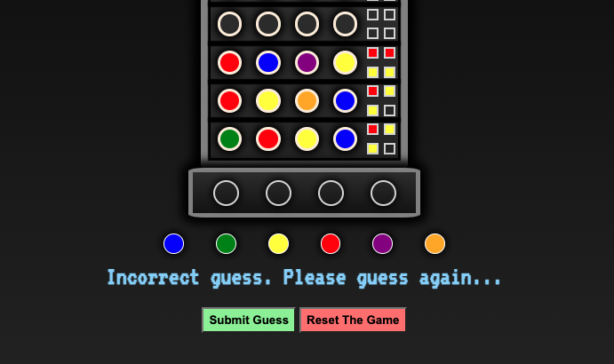

# WarGames

## Description and Background

In the classic game MasterMind, one player selects a "code" made up of 4 colors, which is hidden from the other player.  The other player then has 10 chances to guess the code.  After each guess, the first player will indicate what the second player got right and wrong using colored pegs (typically, a black peg means one correct color in the correct spot, a white peg means one correct color in the wrong spot, and a blank means an incorrect color was chosen).

"War Games" is the classic 1983 film about a young hacker named David who accidentally connects to "Joshua" - the US Military's top secret super computer also known as W.O.P.R.  When Joshua asks "Shall we play a game?", David starts a game of thermonuclear war that the computer believes is real!  In the famous ending of the film, David convinces Joshua to play every possible scenario of thermonuclear war to discover that there is no way to win.  Joshua finally says: "A strange game.  The only winning move is not play." 

 

In this War Games inspired twist on MasterMind, "Joshua" is the computer opponent that has selected a 4-color nuclear launch code.  The player has 10 guesses to break the code and prevent Joshua from launching the nuclear missles.  Design elements for the game were inspired by the film:
- The header was inspired by the film's title logo
- The remaining text was inspired by the blue computer terminal font on David's computer
- The game board resembles the WOPR computer 
- The traditional black and white pegs were replaced with red and yellow - the colors of the many blinking lights on the WOPR computer 
## Screenshots

## Technologies Used
- Javascript
- HTML
- CSS
## Getting Started
- Navigate to https://dvnilsen.github.io/Mastermind/ 
- Scroll to the bottom of the page where Joshua has provided all gameplay instructions.
- Break the code and save the world!
## Next Steps
Planned future improvements include:
- The addition of audio from the film, specifically lines from the synthesized voiced used by Joshua ("Shall we play a game?" upon loading the page, etc).
- Improved CSS styling and responsiveness. 